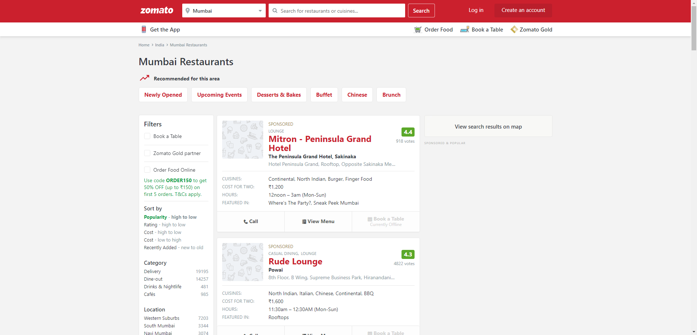

Zomato Web Scraper/Crawler
===========================

A web crawler for zomato using selenium and beautifulsoup. Can be used to scrape restuarants from a particular city, and reviews of each restuarants from the list. Edit the global variables for your own use case.

A multi-threading pool is employed for scraping reviews with BS4, it can further be split into multiple crawlers by dividing the restuarant list to boost the performance.

*Disclaimer*: This web crawler was written for a personal project and is not used for any commercial or personal profit. Zomato holds all the rights for their data.